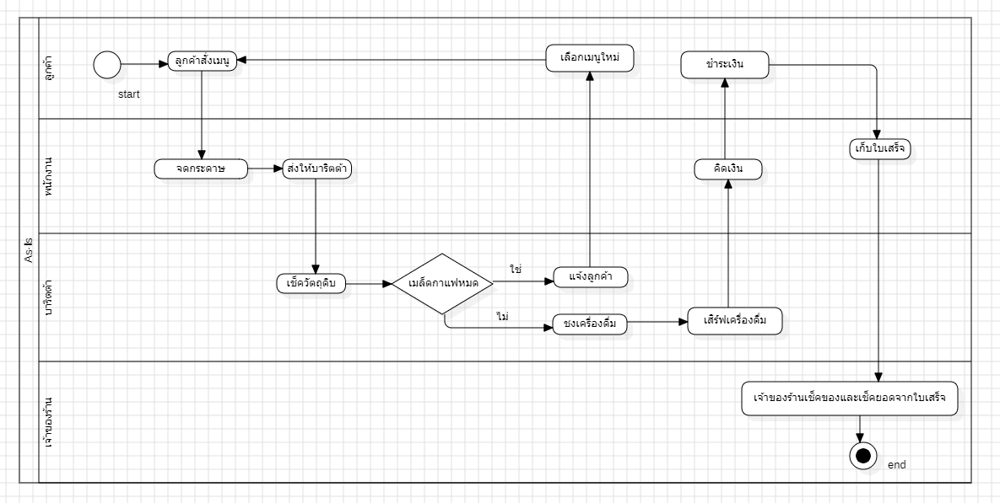
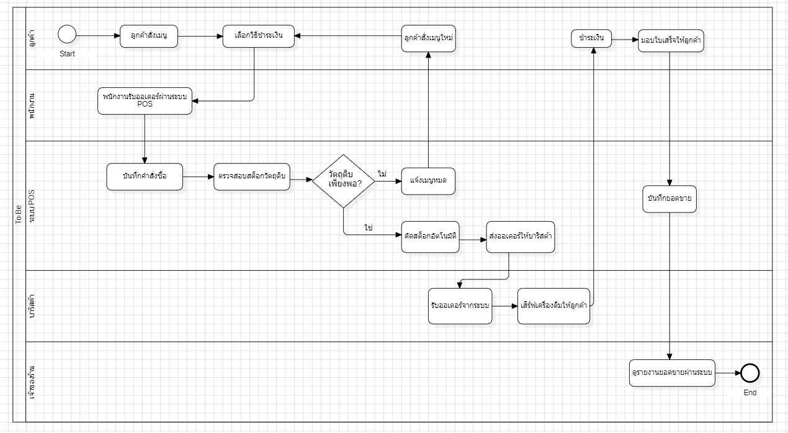

# รายงานการศึกษาความเป็นไปได้ของโครงการ (Project Feasibility Study)

## 📌 ภาพรวมโครงการ (Project Overview)

### ชื่อระบบ

**POS & Smart Inventory System**

### วัตถุประสงค์

* พัฒนาระบบเพื่อให้การรับออเดอร์และการชำระเงินเป็นไปอย่างรวดเร็วและมีประสิทธิภาพ
* ลดความผิดพลาดที่เกิดจากการคำนวณราคาและการบันทึกข้อมูลด้วยวิธีการแบบเดิม
* จัดการสต็อกวัตถุดิบอัตโนมัติ พร้อมอัปเดตจำนวนคงเหลือแบบเรียลไทม์และแจ้งเตือนเมื่อวัตถุดิบใกล้หมด

### ขอบเขตของระบบ (Scope)

* ระบบขายหน้าร้าน (Point of Sale: POS)
* ระบบรับคำสั่งซื้อเครื่องดื่มและเบเกอรี่ พร้อมรองรับการเลือกตัวเลือกของสินค้า
* ระบบจัดการคลังสินค้า ที่สามารถตัดสต็อกวัตถุดิบโดยอัตโนมัติหลังจากการขายแต่ละครั้ง

### ผู้มีส่วนได้ส่วนเสีย (Stakeholders)

* **พนักงานหน้าร้านและบาริสต้า** รับผิดชอบการรับออเดอร์ ชงเครื่องดื่ม และดำเนินการรับชำระเงินผ่านระบบ
* **เจ้าของร้านกาแฟ** ใช้ระบบเพื่อตรวจสอบยอดขาย รายงาน และบริหารจัดการสต็อกวัตถุดิบ
* **ลูกค้า** ได้รับบริการที่รวดเร็ว มีความถูกต้องของรายการสั่งซื้อ และสามารถชำระเงินได้สะดวกมากขึ้น

---

# 💻 ความเป็นไปได้ด้านเทคนิค (Technical Feasibility)

## เทคโนโลยีที่ใช้

* **Backend:** Node.js และ Express.js
* **Database:** MySQL
* **Platform:** โปรแกรมสำหรับใช้งานบนคอมพิวเตอร์หรือโน้ตบุ๊ก

## ความพร้อมของทีม

สมาชิกในทีมมีพื้นฐานด้านการพัฒนาเว็บด้วย Node.js, Express และ MySQL อยู่ในระดับที่สามารถออกแบบและพัฒนาระบบได้ตามขอบเขตของโครงการ แม้อาจต้องศึกษารายละเอียดเพิ่มเติมในบางส่วน

## ความเสี่ยงด้านเทคนิค

การเชื่อมต่อกับบริการภายนอก เช่น ระบบชำระเงินผ่าน QR Payment หรือเครื่องรับชำระเงิน อาจเป็นส่วนที่ทีมยังไม่มีประสบการณ์มากนัก จึงอาจใช้เวลาในการพัฒนาและทดสอบมากกว่าส่วนอื่น

## แนวทางลดความเสี่ยง

วางแผนศึกษาคู่มือและเอกสาร API ของผู้ให้บริการล่วงหน้า รวมถึงทดลองเชื่อมต่อกับระบบตัวอย่างก่อนเริ่มพัฒนาจริง เพื่อช่วยลดปัญหาในระหว่างการพัฒนา

---

# 💰 ความเป็นไปได้ด้านเศรษฐศาสตร์ (Economic Feasibility)

## ต้นทุนโครงการ

* งบประมาณในการพัฒนาโดยประมาณ **30,000 บาท**
* มีค่าใช้จ่ายต่อเนื่อง เช่น ค่าเช่าเซิร์ฟเวอร์ ค่าโดเมน และค่าบำรุงรักษาระบบหลังนำไปใช้งาน

## ผลประโยชน์ที่คาดว่าจะได้รับ

* เพิ่มความรวดเร็วในการรับออเดอร์และคิดเงิน
* ลดความผิดพลาดจากการคำนวณราคาและการบันทึกข้อมูล
* ช่วยควบคุมปริมาณวัตถุดิบ ลดการสูญเสีย และบริหารสต็อกได้แม่นยำขึ้น

## ระยะเวลาคืนทุน

เมื่อพิจารณาจากต้นทุนการพัฒนาและผลประโยชน์ที่ได้รับจากการลดเวลาในการทำงาน รวมถึงการลดต้นทุนจากความผิดพลาด คาดว่าระบบจะสามารถคืนทุนได้ภายใน **ประมาณ 6 เดือน**

---

# ⚙️ ความเป็นไปได้ด้านการดำเนินงาน (Operational Feasibility)

## ผลกระทบต่อการทำงาน

1. เปลี่ยนรูปแบบการรับออเดอร์จากการเขียนลงกระดาษมาเป็นการบันทึกข้อมูลผ่านระบบ POS
2. ลดขั้นตอนการทำงานที่ซ้ำซ้อน ทำให้ข้อมูลการขาย การชำระเงิน และสต็อกเชื่อมโยงกันในระบบเดียว

## ความพร้อมขององค์กร

1. เจ้าของร้านสนับสนุนการนำระบบเข้ามาใช้เพื่อเพิ่มประสิทธิภาพในการบริหารร้าน
2. บุคลากรสามารถปรับตัวเข้าสู่ระบบใหม่ได้ เนื่องจากขั้นตอนการทำงานไม่ซับซ้อนและมีการเตรียมความพร้อมก่อนเริ่มใช้งาน

## แผนการฝึกอบรม

ก่อนเปิดใช้งานจริง จะมีการสอนการใช้งานระบบให้กับพนักงานทุกคน โดยใช้เวลาฝึกอบรมประมาณ **2–3 ชั่วโมง** เพื่อให้สามารถใช้งานระบบได้อย่างถูกต้อง

---

# 📅 ความเป็นไปได้ด้านเวลา (Schedule Feasibility)

| ระยะเวลา             | กิจกรรม                                     |
| -------------------- | ------------------------------------------- |
| **สัปดาห์ที่ 1–4**   | วิเคราะห์ความต้องการและออกแบบระบบ           |
| **สัปดาห์ที่ 5–12**  | พัฒนาฟังก์ชันและฐานข้อมูล                   |
| **สัปดาห์ที่ 13–16** | ทดสอบระบบ ปรับปรุงข้อผิดพลาด และนำเสนอผลงาน |

---

# 📝 สรุปผลการศึกษา (Conclusion)

จากการประเมินทั้งด้านเทคนิค การดำเนินงาน และระยะเวลา พบว่าโครงการมีความเป็นไปได้ในการพัฒนา ทีมงานมีศักยภาพเพียงพอ งบประมาณอยู่ในระดับเหมาะสม และระยะเวลาดำเนินงานสามารถทำได้ตามแผน จึงเห็นควรดำเนินโครงการต่อ

## 📌 BPMN diagram (As-Is และ To-Be)

1. As-Is (กระบวนการเดิม)

2. To-Be (กระบวนการใหม่ด้วยระบบ POS)

## อภิปราย BPMN แบบ To-Be ช่วยแก้ปัญหาที่ระบุใน Operational และ Economic Feasibility ได้ดังนี้ 

### Economic Feasibility
1. เพิ่มความรวดเร็วในการให้บริการ
- หลังจากพนักงานบันทึกออเดอร์ ระบบจะคำนวณยอดเงินโดยอัตโนมัติ และรองรับการชำระเงินผ่าน QR Code ทำให้ลูกค้าใช้เวลาชำระเงินน้อยลงเมื่อเทียบกับวิธีเดิม

2. ลดความผิดพลาดในการทำงาน
- ระบบจะคำนวณราคาและบันทึกข้อมูลการขายโดยอัตโนมัติ ช่วยลดข้อผิดพลาดที่เกิดจากการคิดเงินผิดหรือการเขียนออเดอร์ผิด ส่งผลให้ลดค่าใช้จ่ายในการแก้ไขข้อผิดพลาด
3. ควบคุมสต็อกได้แม่นยำ
- เมื่อมีการขายสินค้า ระบบจะหักจำนวนวัตถุดิบที่เกี่ยวข้องทันที ทำให้สามารถติดตามปริมาณคงเหลือได้ตลอดเวลา ลดการสั่งซื้อเกินความจำเป็นและลดการสูญเสียวัตถุดิบ
4. สนับสนุนการคืนทุนของโครงการ
- การลดระยะเวลาในการทำงาน ลดความผิดพลาด และบริหารวัตถุดิบได้มีประสิทธิภาพ ช่วยลดต้นทุนการดำเนินงาน และเพิ่มโอกาสให้โครงการคืนทุนได้ภายในเวลาที่กำหนด
### Operational Feasibility
1. เปลี่ยนรูปแบบการรับออเดอร์
- ในกระบวนการใหม่ พนักงานรับรายการสั่งซื้อผ่านระบบ POS ทำให้ข้อมูลถูกส่งเข้าสู่ระบบทันที ไม่ต้องใช้กระดาษ ลดความผิดพลาดจากการอ่านหรือเขียนข้อมูล

2. ขั้นตอนการทำงานมีมาตรฐาน
- BPMN แสดงลำดับการทำงานที่ชัดเจน ตั้งแต่รับออเดอร์ ตรวจสอบสินค้า ชำระเงิน ส่งรายการให้บาริสต้า และอัปเดตสต็อก ทำให้พนักงานทุกคนปฏิบัติงานในรูปแบบเดียวกัน
3. เชื่อมโยงการทำงานระหว่างหน้าร้านและหลังบ้าน
- ระบบส่งข้อมูลคำสั่งซื้อไปยังบาริสต้าโดยอัตโนมัติ พร้อมทั้งบันทึกยอดขายและปรับปรุงข้อมูลสต็อกในเวลาเดียวกัน ช่วยลดงานซ้ำซ้อนและเพิ่มความคล่องตัวในการทำงาน
4. เตรียมความพร้อมของผู้ใช้งาน
- ก่อนเริ่มใช้งานจริง จะมีการอบรมพนักงานเกี่ยวกับการใช้งานระบบ POS เพื่อให้สามารถใช้งานได้อย่างมั่นใจ ลดปัญหาที่อาจเกิดขึ้นในช่วงเริ่มต้นของการใช้งาน