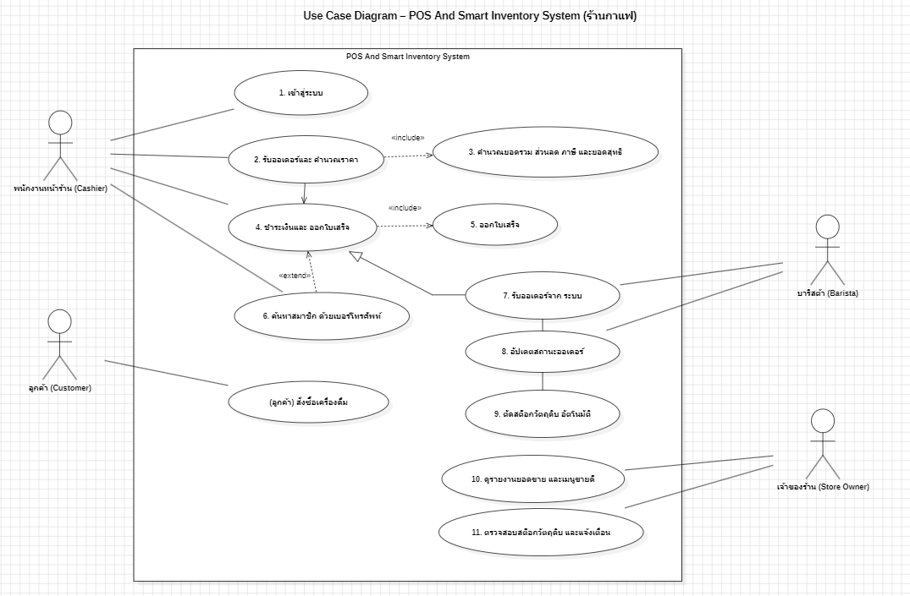

# User Stories และ Use Case Diagram

## User Stories

## 1. การเลือกเมนูและตัวเลือกเครื่องดื่ม

- **US-01:** As a พนักงานหน้าร้าน\
  I want เลือกเมนู ขนาด และท็อปปิ้งผ่านหน้าจอออเดอร์\
  So that ผมสามารถสร้างออเดอร์ได้ถูกต้องและรวดเร็ว

- **Acceptance Criteria:**
  - Given พนักงานอยู่บนหน้าจอรับออเดอร์ When พนักงานเลือกเมนู Then
    ระบบเพิ่มรายการเมนูลงในออเดอร์ปัจจุบัน
  - Given พนักงานเลือกเมนูแล้ว When พนักงานเลือกขนาดและท็อปปิ้ง Then
    ระบบบันทึกตัวเลือกเหล่านั้นไว้กับออเดอร์

## 2. การคำนวณเงินและยอดสุทธิ

- **US-02:** As a พนักงานหน้าร้าน\
  I want ระบบคำนวณยอดเงินของออเดอร์อัตโนมัติ\
  So that ผมสามารถยืนยันยอดชำระเงินได้อย่างรวดเร็วและถูกต้อง

- **Acceptance Criteria:**
  - Given มีออเดอร์ที่ถูกสร้างขึ้นแล้ว When พนักงานเข้าสู่หน้าจอชำระเงิน Then
    ระบบคำนวณยอดรวม ส่วนลด และภาษีอัตโนมัติ
  - Given ระบบคำนวณยอดเสร็จแล้ว When พนักงานดูหน้าจอชำระเงิน Then
    ระบบแสดงยอดสุทธิให้ตรวจสอบ

## 3. การชำระเงินและออกใบเสร็จ

- **US-03:** As a พนักงานหน้าร้าน\
  I want รับชำระเงินและออกใบเสร็จ\
  So that ผมสามารถยืนยันการขายให้ลูกค้าได้

- **Acceptance Criteria:**
  - Given มีออเดอร์และยอดสุทธิถูกต้อง When พนักงานรับชำระเงินสำเร็จ Then
    ระบบบันทึกสถานะการชำระเงิน
  - Given การชำระเงินสำเร็จ When ระบบยืนยันการขาย Then
    ระบบออกใบเสร็จให้ลูกค้า

## 4. การส่งออเดอร์ให้บาริสต้า

- **US-04:** As a บาริสต้า\
  I want ระบบส่งรายละเอียดออเดอร์ไปยังหน้าจอของผมหลังชำระเงินสำเร็จ\
  So that ผมสามารถเริ่มเตรียมเครื่องดื่มได้ทันที

- **Acceptance Criteria:**
  - Given การชำระเงินสำเร็จแล้ว When ระบบยืนยันคำสั่งซื้อ Then
    ระบบส่งรายละเอียดออเดอร์ไปยังหน้าจอบาริสต้า
  - Given มีออเดอร์ใหม่เข้ามา When บาริสต้าเปิดหน้าจอคิวออเดอร์ Then
    ระบบแสดงออเดอร์พร้อมรายละเอียดเมนูและตัวเลือก

## 5. การตัดสต็อกวัตถุดิบ

- **US-05:** As a เจ้าของร้าน\
  I want ระบบตัดสต็อกวัตถุดิบอัตโนมัติหลังการขาย\
  So that ผมสามารถควบคุมปริมาณวัตถุดิบและลดปัญหาของหมดโดยไม่รู้ตัว

- **Acceptance Criteria:**
  - Given มีการขายสินค้าและชำระเงินสำเร็จ When ระบบบันทึกการขาย Then
    ระบบต้องตัดจำนวนวัตถุดิบตามรายการขาย
  - Given วัตถุดิบมีจำนวนใกล้หมด When ระบบตัดสต็อกแล้วพบว่าต่ำกว่าระดับที่กำหนด
    Then ระบบต้องแสดงการแจ้งเตือนวัตถุดิบใกล้หมด

## 6. การค้นหาสมาชิกด้วยเบอร์โทรศัพท์

- **US-06:** As a พนักงานหน้าร้าน\
  I want ค้นหาข้อมูลสมาชิกด้วยหมายเลขโทรศัพท์\
  So that ผมสามารถตรวจสอบและบันทึกคะแนนสะสมหลังการขายได้

- **Acceptance Criteria:**
  - Given พนักงานป้อนหมายเลขโทรศัพท์ของสมาชิก When ระบบค้นหาสมาชิก Then
    ระบบแสดงข้อมูลสมาชิกและคะแนนสะสมหากพบ
  - Given พบสมาชิกที่ถูกต้องแล้ว When การขายเสร็จสิ้น Then
    ระบบบันทึกคะแนนสะสมจากการขายให้สมาชิก

## 7. การดูรายงานยอดขาย

- **US-07:** As a เจ้าของร้าน\
  I want ดูรายงานยอดขายรายวัน รายเดือน และเมนูขายดี\
  So that ผมสามารถติดตามผลการขายและวางแผนการดำเนินงานของร้านได้

- **Acceptance Criteria:**
  - Given เจ้าของร้านเข้าสู่หน้ารายงาน When เลือกช่วงเวลาที่ต้องการ Then
    ระบบแสดงยอดขายตามช่วงเวลาที่เลือก
  - Given มีข้อมูลการขาย When เจ้าของร้านเลือกดูเมนูขายดี Then
    ระบบแสดงรายการเมนูที่มียอดขายสูง

## 8. การเข้าสู่ระบบ

- **US-08:** As a พนักงานหน้าร้าน\
  I want เข้าสู่ระบบก่อนใช้งาน\
  So that ระบบสามารถตรวจสอบสิทธิ์และป้องกันการใช้งานโดยไม่ได้รับอนุญาต

- **Acceptance Criteria:**
  - Given พนักงานมีบัญชีผู้ใช้ When กรอกชื่อผู้ใช้และรหัสผ่านถูกต้อง Then
    ระบบอนุญาตให้เข้าสู่ระบบ
  - Given พนักงานกรอกข้อมูลไม่ถูกต้อง When กดเข้าสู่ระบบ Then
    ระบบแสดงข้อความแจ้งเตือนและไม่อนุญาตให้เข้าใช้งาน

---

## Actor ที่เกี่ยวข้องกับระบบร้านกาแฟ

บทบาท (Actor) ใช้ระบบทำอะไร

พนักงานหน้าร้าน (Cashier) เข้าสู่ระบบรับออเดอร์เลือกเมนูและตัวเลือกเครื่องดื่ม คำนวณราคารับชำระเงินและค้นหาสมาชิก

บาริสต้า (Barista) รับรายการออเดอร์เพื่อเตรียมเครื่องดื่ม

เจ้าของร้าน (Store Owner) ดูรายงานยอดขายและตรวจสอบสต็อกวัตถุดิบ

ลูกค้าสมาชิก (Member Customer) ใช้บริการสมาชิกและสะสมคะแนนจากการซื้อสินค้า

---

## Use Case Diagram

**ระบบ:** POS And Smart Inventory System

## การตรวจสอบตามหลัก INVEST

User Story ผลการตรวจสอบ ข้อสังเกต

---

US-01 ผ่าน ขอบเขตเน้นการเลือกเมนูและตัวเลือกเครื่องดื่ม

US-02 ผ่าน เน้นการคำนวณยอดรวม ส่วนลด ภาษี และยอดสุทธิ
US-03 ผ่าน เน้นการรับชำระเงินและออกใบเสร็จ

US-04 ผ่าน เน้นการส่งออเดอร์ไปยังหน้าจอบาริสต้า

US-05 ผ่าน เน้นการตัดสต็อกอัตโนมัติหลังการขาย

US-06 ผ่าน เน้นการค้นหาสมาชิกและบันทึกคะแนนสะสม

US-07 ผ่าน เน้นรายงานยอดขายและเมนูขายดี

US-08 ผ่าน เน้นการเข้าสู่ระบบก่อนใช้งาน

**สรุป:** User Story ทั้ง 8 เรื่องมีขอบเขตชัดเจน มีคุณค่าต่อผู้ใช้งาน
สามารถประเมินและทดสอบได้ และมีขนาดเหมาะสมสำหรับการพัฒนาเป็นแต่ละฟังก์ชัน

---

## ความเชื่อมโยงกับ Functional Requirements

Functional Requirement User Story

---

FR-01 ระบบให้พนักงานเข้าสู่ระบบ US-08

FR-02 เลือกเมนู ขนาด และท็อปปิ้ง US-01

FR-03 คำนวณราคารวม ภาษี และส่วนลด US-02

FR-04 รับชำระเงินและออกใบเสร็จ US-03

FR-05 ส่งออเดอร์ไปยังบาริสต้า US-04

FR-06 ตัดสต็อกวัตถุดิบอัตโนมัติ US-05

FR-07 ค้นหาสมาชิกและบันทึกคะแนน US-06

FR-08 แสดงรายงานยอดขาย US-07

